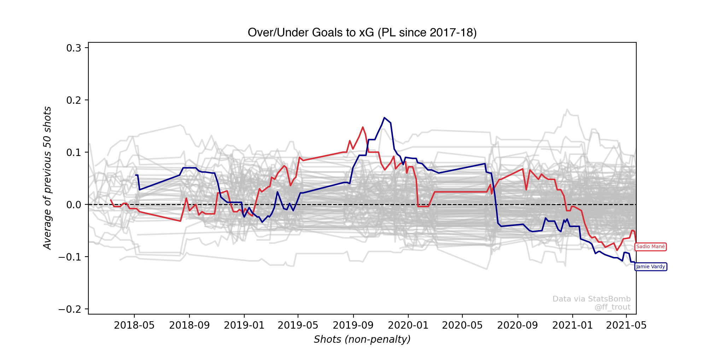

# finishing_plot

finishing_plot is a script to plot the trends in finishing for footballers in Europe's big 5 leagues, 
by tracking their rolling average G-xG over a given range of shots from Understat or StatsBomb.

In main.py users can select the league, data source, rolling average window, which players to highlight,
and whether the x axis represents time or shot volume (see below).

